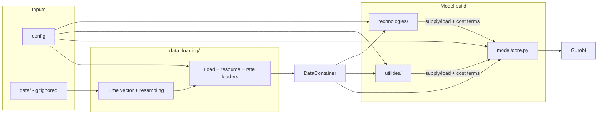

# DERopt Python/Pyomo Rebuild Plan

## 1. Reference: Current MATLAB Structure

The existing model is a MATLAB codebase (**DERopt**) with the following structure. Entry points are **playground** scripts in the `Design/` folder (e.g. `playground.m`, `playground_demo_function.m`).

- **Formulation**: YALMIP builds the model; it is exported to **Gurobi** (and optionally CPLEX) in `Problem_Formulation_Multi_Node/opt.m` and `Problem_Formulation_Single_Node/opt.m`.
- **Data flow**: Load profiles and time series come from **Load_Processing** (e.g. `bldg_loader.m`, `bldg_loader_UCI.m`); technology parameters from **Techno_Economic** (`tech_select.m`, `tech_payment.m`); import/export and demand charges from **utility** scripts and `elec_vecs.m` (TOU expansion). Multi-node cases use MATPOWER (`mpc`) and a **T_map** (building-to-node mapping) and **opt_xfmrs** / **opt_DLPF** for network constraints.
- **Objective**: Minimize total cost = energy import cost + demand charges - export value + technology capital (annuity) + O&M.
- **Core constraints**: Energy balances (electrical, thermal, chemical/H2), per-technology limits (PV capacity, EES SOC/charge/discharge, etc.), optional NEM and grid limits, and for multi-node: transformer limits and DLPF/LinDistFlow (voltage, branch flow).

The Python version will replicate this structure in a cleaner, data-driven way and support the features you asked for (multiple energy types, renewable profiles, import/export from data, multiple technologies, multi-node networks).

---

## 2. Target Repository and High-Level Architecture

- **Repository**: Implement in a new project directory (e.g. `DERopt_Python` or similar).
- **Solver**: Pyomo + **Gurobi** (primary). Optionally allow HiGHS/CBC via the same interface for users who do not have Gurobi.

Proposed layout:

```text
<project_root>/
  config/                 # Run/config schemas (e.g. YAML or dataclass)
  data/                   # Actual data files (load profiles, rates, network inputs)
                          # Gitignored - too large for repo; paths in config point here
  data_loading/           # Code that reads data and builds the data container
    loaders/              # Load profiles, resource profiles, rates (Python modules)
    schemas.py            # Data container type / expected keys (e.g. dataclass)
  model/                  # Pyomo model
    core.py               # Meeting place: Sets, params, energy balance assembly (no tech-specific or utility-specific logic)
  utilities/              # Grid/tariff and network (separate from technologies; config-driven inclusion)
    electricity_import_export.py   # Import/export vars, demand charges, NEM, import limits, rate-based objective terms
    network.py            # Multi-node: Pinj, DLPF/LDF, transformers
  technologies/           # One module per technology (config-driven inclusion)
    solar_pv.py
    wind.py
    hydrokinetic.py
    run_of_river.py
    dam_hydro.py
    pumped_hydro.py
    battery_energy_storage.py
    flow_battery_energy_storage.py
    diesel_generation.py
    gas_turbine.py
    high_temperature_fuel_cell.py
    pem_electrolyzer.py
    alkaline_electrolyzer.py
    compressed_gas_hydrogen_storage.py
    pem_fuel_cell.py
  run/                    # Entry point (legacy name from MATLAB)
    playground.py          # Main script to run: loads config, data, builds model, solves
  tests/
  requirements.txt
  README.md
```

- `**data/**`: Holds the actual input files (CSV, Excel, .mat, MATPOWER cases, etc.). Add `data/` to `.gitignore`; config or environment specifies the path to `data/` (or an override) so loaders know where to read from.
- `**data_loading/**`: Python code only - loaders read from `data/` (or a configured path) and return the unified data container used by the model.
- `**model/core.py**`: Meeting place only - defines Sets and Params, assembles energy balances from supply/load terms, and assembles the single objective by summing cost contributions from utilities and technologies (core does not define the formula for those costs).
- `**utilities/**`: Grid/tariff and network - `electricity_import_export.py` (import/export, demand charges, NEM), `network.py` (multi-node). Config-driven; provide supply/load terms and cost terms to core.
- `**technologies/**`: One module per technology (solar_pv, wind, batteries, diesel, gas turbine, fuel cells, electrolyzers, H2 storage). Config-driven; provide supply/load terms and cost terms to core.

**Summary: repository layout**

| Component             | Path / role                                                                                    |
| --------------------- | ---------------------------------------------------------------------------------------------- |
| **Config**            | `config/` - Run/config schemas (e.g. YAML or dataclass).                                       |
| **Data (gitignored)** | `data/` - Actual input files (loads, rates, network); paths in config.                         |
| **Data loading**      | `data_loading/` - Loaders + `schemas.py`; read from `data/`, output DataContainer.             |
| **Core model**        | `model/core.py` - Sets, Params, balance assembly, objective sum.                               |
| **Utilities**         | `utilities/` - `electricity_import_export.py`, `network.py`; supply/load + cost terms to core. |
| **Technologies**      | `technologies/` - One module per technology; supply/load + cost terms to core.                 |
| **Entry point**       | `run/playground.py` - Load config, build data, build model, solve, results.                    |
| **Tests**             | `tests/` - Unit tests, small model solve.                                                      |

**Data flow (inputs -> model):**



**Execution flow (run/playground.py):**

1. **Load config** - paths to `data/`, which utilities and technologies are enabled, single vs multi-node, etc.
2. **Build data** - `data_loading/`: establish master time vector (resampling, optional load smoothing), then load profiles, resource profiles, and rates aligned to that time vector; output `DataContainer`.
3. **Build model** - Create Pyomo `ConcreteModel`.
  - **model/core.py**: Define Sets (`T`, `K`, ...), Params from `DataContainer` (e.g. `electricity_demand`). Do not yet add balance constraints or full objective.
  - **utilities/**: Add electricity_import_export block (and optionally network block if multi-node). Each block adds its vars/constraints and registers its **electricity_supply_term**, **electricity_load_term**, and **objective contribution** with core.
  - **technologies/**: For each enabled technology (from config), add its block. Each registers supply/load terms for electrical (and optionally thermal, H2) and its objective contribution.
  - **model/core.py**: Add electrical (and thermal, H2) balance constraints by summing the registered supply and load terms. Form the single objective by summing the registered cost contributions (core does not define what each contribution is-only the sum).
4. **Solve** - `SolverFactory('gurobi').solve(model)`.
5. **Results** - Extract and optionally write capacities, dispatch, costs (e.g. to CSV or report).

---

## 3. Data Layer (Load Profiles, Resources, Rates, Network)

**3.0 Time vector as master index**

Loading and alignment of energy data are critical. The **time vector** is the master index: all load, resource (e.g., solar and wind), and rate series in the data container must be defined on the same regular time grid so the model's set `T` has a single, consistent index.

- **Resampling irregular time**: Raw data may have irregular or sporadic timestamps (e.g. readings at varying minutes within the hour). Loaders must support **resampling/aggregation** to a regular time step (e.g. hourly or 15-minute). Options: (1) bin raw points into intervals and aggregate (sum for energy, mean for rates/capacity factors), or (2) interpolate to a regular datetime index. The output is a regular `time` array (length T) and all series have length T.
- **Filtering/smoothing of building load**: Raw building load data may contain **signal noise**. Support optional **filtering** when loading (e.g. moving average over a configurable window, or minimum-threshold to drop spurious zeros). Config should allow enabling/disabling and tuning (window size, min fraction of mean). Filtering is applied after resampling so the load series remains aligned to the master time vector.
- **Alignment of other inputs to the time vector**: Once the master time vector is fixed (from load data after resampling and optional filtering, or from an explicit requested range/interval):
  - **Solar, wind, hydro**: Resource profile data (often from separate files or longer series) must be **selected or interpolated** to match the time vector (same datetimes or same index range). E.g. interpolate solar irradiance to `time` if the solar file has different timestamps.
  - **Import/export rates**: TOU and export rates are **expanded to the time vector** (e.g. map each `time[t]` to the correct rate tier by hour-of-day and month). Result: `electricity_import_price[t]` and `electricity_export_price[t]` for each t in T.

Implement this in `data_loading/`: a **time** utility or first step that (1) builds the regular time vector from load data (with resampling and optional smoothing), then (2) all other loaders (resources, rates) take that time vector and return series of length T.

**3.1 Load profiles**

- Support at least **electrical**, **thermal** (heating, cooling), and **chemical** (e.g. H2 demand) time series. Allow for future inclusion of **domestic_hot_water** and **industrial_heat** as separate load types if needed (may not be implemented initially).
- One or more "buildings" or "load buses" with a shared time index; **T_map** is the **transformer map**: it maps each building/load bus to a transformer (node). Multiple buildings or loads can be connected to the same transformer and can have **different behavior** (e.g. different load profiles, tariff classes, or DER); the model aggregates or disaggregates as needed for network constraints.
- **Loaders**: Read from CSV or Excel (and optionally `.mat` via `scipy.io` for parity with existing data). Apply **resampling** to regular steps (hourly or 15-min) and **optional smoothing** (see 3.0). Output a unified structure, e.g.:
  - `time` (regular index or datetime, length T),
  - `electricity`, `thermal_heating`, `thermal_cooling`, `hydrogen_demand` (descriptive names) as 1D or 2D arrays (T) or (T, K); optionally `domestic_hot_water`, `industrial_heat` for future use,
  - `month_endpoints` / `month_startpoints` for monthly boundaries if demand charges are used,
  - `day_weight`: when the optimization uses fewer than 365 days (e.g. representative days), this weighting factor scales costs from those days up to a full year so that energy costs are annualized correctly.
- **Filtering**: Support year/month selection and time-step conversion (e.g. 15 min vs hourly) as in the MATLAB `bldg_loader_UCI.m` pattern.

**3.2 Renewable resource profiles**

- **Solar**: Normalized or absolute (e.g. kW/m^2 or capacity factor) per time step - used like `solar` in the MATLAB `opt_pv.m` formulation.
- **Wind**: Same idea (capacity factor or power curve input).
- **Hydro family (stand-alone)**:
  - **Hydrokinetic**: resource signal from flow velocity/current profile (or precomputed available power).
  - **Run-of-river**: available flow/head or precomputed available power profile (e.g. `opt_run_of_river.m` parity path).
  - **Dam hydro**: inflow profile + storage/reservoir state data and operating limits.
  - **Pumped hydro**: two-mode data (pumping/generation), storage volume limits, and round-trip efficiency inputs.
- Load from CSV/Excel (and optionally `.mat`). **Align to the master time vector**: select or interpolate so `solar_capacity_factor`, wind, and hydro-family series have length T and correspond to `time` (see 3.0). Allow different profiles per node or per technology if needed.

**3.3 Import/export rates (retail)**

- **Import rates**: The two most common cases are **(1) fixed charges** (single or tiered energy price, optional demand charges) and **(2) time-varying rates from a table** with **24-hour resolution** by **season** (e.g. summer/winter) and **day type** (weekday/weekend), e.g. as provided by **OpenEI** ([Open Energy Information](https://openei.org/)) or similar sources that publish utility tariff data in Excel/CSV. Include optional **demand charges** (non-TOU, on-peak, mid-peak) with monthly windows where applicable. **Switching between options**: The model stays the same-it only ever sees a single `electricity_import_price[t]` (and demand charge params). The **loader** is where the choice is made: one loader path fills the vector from fixed params, another from an Excel/OpenEI-style sheet (map season + weekday/weekend + hour to each t). So switching is straightforward (config or loader selection); no model logic change.
- **Export rates**: Structure varies widely. For example, **California** export rates can be based on **wholesale electricity prices** that **change by hour** and are often **loaded in as a vector directly** (e.g. historical or forecast LMP). Other regimes use NEM (e.g. export credit tied to import rate), fixed buyback, or other rules. Support loading export price as a **time series aligned to the master time vector** (e.g. `electricity_export_price[t]`) or deriving it from a rule (e.g. NEM).
- Load from Excel (e.g. OpenEI-style tariff tables or utility-specific workbooks), CSV, or pre-built vectors. **Expand or align to the master time vector** so the model sees `electricity_import_price`, `electricity_export_price` (length T), and any demand charge parameters. Loader code lives in `data_loading/`; actual files in `data/` (gitignored).

**3.3a Electricity market components (separate subtask)**

- **Separate from retail import/export**, the model may need to represent **electricity market** components such as **wholesale** energy, **regulation** (ancillary services), and **capacity** markets. These typically have different products, settlement rules, and time granularity. Treat **electricity markets** as their **own subtask**: define data needs (e.g. wholesale LMP, regulation prices, capacity payment structures), how they map to the time vector and to decision variables (import/export, reserves, capacity obligations), and where they attach in the model (e.g. extensions to `utilities/` or a dedicated market module). To be scoped and implemented after core retail import/export is in place.

**3.4 Network (multi-node)**

- **Nodes**: Set of nodes; one node is typically the "slack" (grid connection).
- **Buildings/loads**: Map each load bus to a node (T_map: load index -> node index).
- **Branches**: From MATPOWER case or from a simple table (from_bus, to_bus, R, X, rate_A or MVA).
- **Transformers**: Optional; per-branch or per-node ratings and polygon (P,Q) constraints as in the MATLAB `opt_xfmrs.m` formulation (Problem_Formulation_Multi_Node).
- Load MATPOWER cases (e.g. `caseAEC_XFMR_4`) via a reader (e.g. [PyPower](https://pypower.org/) or custom parser) to get `baseMVA`, `bus`, `gen`, `branch` and derive admittance for DLPF.

**Summary: data types produced by the data layer**

| Category              | Item                                                                                                                | Description                                                                           |
| --------------------- | ------------------------------------------------------------------------------------------------------------------- | ------------------------------------------------------------------------------------- |
| **Time**              | `time`                                                                                                              | Master time index (length T); regular grid after resampling.                          |
| **Loads**             | `electricity_demand`, `thermal_heating`, `thermal_cooling`, `hydrogen_demand`                                       | 1D or 2D (T) or (T,K); optional `domestic_hot_water`, `industrial_heat`.              |
|                       | `month_endpoints`, `month_startpoints`                                                                              | Monthly boundaries for demand charges.                                                |
|                       | `day_weight`                                                                                                        | Weight to annualize costs when using fewer than 365 days.                             |
| **Resources**         | `solar_capacity_factor`, `wind_capacity_factor`                                                                     | Length T; aligned to `time`. Optional hydro profile.                                  |
| **Rates**             | `electricity_import_price`, `electricity_export_price`                                                              | Length T; from fixed params or OpenEI-style/utility table.                            |
|                       | Demand charge params                                                                                                | Non-TOU, on-peak, mid-peak rates and windows.                                         |
| **Network**           | `load_bus_to_node_map` (T_map), branch/node params                                                                  | Multi-node only.                                                                      |
| **Technology params** | Per-technology: efficiencies, bounds, capex/opex, optional `existing_<tech>_capacity`, optional existing cost terms | Consumed by each technology block; existing_* used for brownfield (keep/expand) runs. |

---

## 4. Core Pyomo Model (meeting place only)

**core.py** is the meeting place for all options: it defines shared Sets and Params and assembles energy balances from **collected supply/load terms** provided by enabled utility modules (if any) and technology blocks. It does **not** own utility-specific variables or constraints, and does **not** implement tariff/NEM/import-limit logic.

**4.1 Sets**

| Set | Description                                                            |
| --- | ---------------------------------------------------------------------- |
| `T` | Time steps (length of master time vector).                             |
| `K` | Load buses / buildings.                                                |
| `N` | Nodes (multi-node only).                                               |
| `M` | Months (optional; for demand charge indexing, used by utility module). |

**4.2 Parameters (from data layer, attached in core or passed to blocks)**

| Category             | Parameters                                                                                    | Description                                                    |
| -------------------- | --------------------------------------------------------------------------------------------- | -------------------------------------------------------------- |
| **Loads**            | `electricity_demand[t]` (or per-bus), `thermal_heating`, `thermal_cooling`, `hydrogen_demand` | From DataContainer; used in balance constraints.               |
| **Resources / tech** | Per-technology params                                                                         | Consumed by respective technology blocks (not stored in core). |

**4.3 Variables**

- Core does **not** define `electricity_import` or `electricity_export`; those live in the electricity_import_export module when that module is enabled. Technology variables live in their own blocks.

**4.4 Objective**

- Core does **not** define the formula for each cost term-each utility and technology block does that. Core's only job is to **assemble** the total objective: it **sums** the cost expressions that blocks have registered. So we need core for the objective only because Pyomo expects a single objective expression; core is the place that forms `minimize( sum of registered contributions )`. No objective logic lives in core beyond that sum.

**4.5 Core constraints (balance assembly only)**

- **Electrical balance**:
`sum(electricity_supply_terms) == electricity_demand + sum(electricity_load_terms)`
where terms are provided by enabled **utilities** modules (e.g., electricity_import_export when active) and by **technology** blocks. Core iterates over collected terms; no hard-coded tech or utility names.
- **Thermal balance**: same pattern - sum of thermal supply terms == thermal demand + sum of thermal load terms (if any).
- **Hydrogen balance**: sum of H2 supply terms == sum of H2 load terms (+ external demand).
- **Feasibility slack for islanded studies (recommended)**: include optional `unserved_electricity[t] >= 0` (and optional curtailment) with a very large penalty in the objective. Keep electrical balance as an equality by registering this slack as a supply/load term, and set penalty high enough that slack is used only when physically unavoidable.

**4.6 Summary: data types and model components available to core and solver**

The following table summarizes the **data types** (loads, resources, rates) and **model components** (utilities, technologies) that should be available to **core.py** and the **main solver**. Core uses the data to define Sets/Params and to assemble balances and objective from the components; the solver receives the full assembled model.

| Interface category             | Key object / block           | What core.py and solver consume                                                                                                                                                                            |
| ------------------------------ | ---------------------------- | ---------------------------------------------------------------------------------------------------------------------------------------------------------------------------------------------------------- |
| **Indices**                    | `indices`                    | `time` (required), optional `nodes`, optional `months`; canonical sets used to build Pyomo sets.                                                                                                           |
| **Time-varying data**          | `timeseries`                 | Single validated container for all `(T)` or `(T,K)` vectors: loads, resources, prices, and optional signals (e.g., `day_weight`).                                                                          |
| **Static scalar/tabular data** | `static`                     | Non-time-indexed parameters such as tariff windows, demand-charge definitions, limits, and constants.                                                                                                      |
| **Technology parameters**      | `tech_params[tech_name]`     | Per-technology parameter groups (efficiencies, capex/opex, bounds, lifetimes, **optional existing capacity and existing cost terms** for brownfield runs) consumed by technology modules.                  |
| **Network data (optional)**    | `network`                    | Multi-node inputs: mappings (e.g., `T_map`), branch/node electrical parameters, transformer limits.                                                                                                        |
| **Utility model components**   | `utilities` modules          | Utility blocks (e.g., import/export, demand charges, tariff logic) register constraints and objective terms.                                                                                               |
| **Technology components**      | `technologies` modules       | Technology blocks register variables/constraints/objective terms and expose supply/load terms to balances; each block may take optional **existing_capacity** (and existing cost) params from tech_params. |
| **Core assembly contract**     | `core.py` registry interface | Core does not hard-code technologies/utilities; it assembles balances and total objective from registered terms only.                                                                                      |

Only **enabled** data and **included** components (per config) are passed to core; core and the solver see a single consistent model built from these pieces.

---

## 4a. Electricity import/export (utility module)

**utilities/electricity_import_export.py** is in its own subcategory **utilities/** (parallel to **technologies/**). Utility rules can be complex (TOU, NEM, demand charges, import limits, export caps, etc.) and may require specific constraints that are **external and separate from core.py**. Keeping them under `utilities/` keeps core as a clean meeting place and allows multiple utility modules (e.g. different tariff or grid-rule sets) without mixing with technology blocks.

**Responsibilities**

- **Variables**: `electricity_import[t]`, `electricity_export[t]`; demand charge variables (`demand_charge_nontou[m]`, `demand_charge_on_peak`, `demand_charge_mid_peak`) if applicable.
- **Parameters** (from data): `electricity_import_price[t]`, `electricity_export_price[t]`; demand charge rates and monthly endpoints; optional import/export limits.
- **Constraints**: All utility-specific rules (demand charge inequalities, NEM, import/export limits, tariff- or jurisdiction-specific rules).
- **Objective contribution**: Import cost + demand charges - export revenue; the block exposes a cost expression that core adds to the total objective.
- **Balance interface**: The block provides `electricity_supply_term = electricity_import` and `electricity_load_term = electricity_export` so core includes them in the electrical balance without knowing utility details.

**Summary: electricity_import_export module**

| Item                       | Description                                                                                                                             |
| -------------------------- | --------------------------------------------------------------------------------------------------------------------------------------- |
| **Variables**              | `electricity_import[t]`, `electricity_export[t]`; demand charge vars (`demand_charge_nontou[m]`, on-peak, mid-peak) if applicable.      |
| **Parameters**             | `electricity_import_price[t]`, `electricity_export_price[t]`; demand charge rates and monthly endpoints; optional import/export limits. |
| **Constraints**            | Demand charge inequalities, NEM, import/export limits, tariff-specific rules.                                                           |
| **Supply term to core**    | `electricity_import`.                                                                                                                   |
| **Load term to core**      | `electricity_export`.                                                                                                                   |
| **Objective contribution** | Import cost + demand charges - export revenue.                                                                                          |

---

## 5. Technology Modules (Pyomo Blocks or registered constraints)

Each technology is a **module** that:

- Declares its **variables** (including a **capacity adoption** term-e.g. capacity adopted or total capacity-plus dispatch, state of charge where applicable, etc.). Every technology should have some **capacity adoption** (or equivalent) variable so the optimizer can size or choose the asset.
- Adds **constraints** (capacity limits, SOC dynamics, efficiency links).
- Adds **objective terms** (capital annuity + O&M).
- Optionally exposes **supply/load terms** for core energy balances (see pluggable balance design).

**Grid import/export** and all utility rules (demand charges, NEM, import limits, etc.) live under **utilities/** (e.g. `utilities/electricity_import_export.py`), not in core or under technologies.

**Existing (legacy) generation**: A location may have **existing** assets - e.g. existing solar PV, existing diesel generators - and the optimization can decide whether to **keep** what is there and/or **expand**. Model this **within each technology component**: each technology block accepts an optional **existing capacity** parameter (and optionally existing O&M or cost terms) from **tech_params** (or config). In each module, **total available capacity** = existing capacity + capacity adopted (e.g. `solar_generation[t] <= solar_capacity_factor[t] * (existing_solar_capacity + photovoltaic_capacity_adopted)`). The objective can treat existing as sunk (no new capital) and charge only O&M, while new capacity adds capital annuity + O&M. Optionally, a **keep/retire** decision for existing assets can be modeled (e.g. binary or fixed to "keep" in a first version). Config or tech_params supply existing capacity per technology so "greenfield" vs "existing + expand" runs are both supported.

**Explicit technology set** (inclusion per run is config-driven; each can be enabled/disabled or gated on resource availability):

**Generation**

| Technology                            | Key variables (descriptive)                                                         | Key constraints / notes                                                                                                                                          |
| ------------------------------------- | ----------------------------------------------------------------------------------- | ---------------------------------------------------------------------------------------------------------------------------------------------------------------- |
| **solar_pv**                          | `solar_generation[t]`, `solar_capacity_adopted`                                     | `solar_generation <= solar_capacity_factor * photovoltaic_capacity_adopted`; maximum_solar_capacity                                                              |
| **wind**                              | `wind_generation[t]`, `wind_capacity_adopted`                                       | `wind_generation <= wind_capacity_factor * wind_capacity_adopted`                                                                                                |
| **diesel_generation**                 | `diesel_generation[t]`, `diesel_fuel[t]`, `diesel_capacity_adopted`                 | Efficiency/fuel consumption, capacity; optional MILP: operational state (on/off), min/max load. Optional detail: part-load efficiency via heat rate (see below). |
| **gas_turbine**                       | `gas_turbine_electricity[t]`, `gas_turbine_fuel[t]`, `gas_turbine_capacity_adopted` | MILP: **operational state** (on/off), **minimum/maximum load**; efficiency or heat rate. Optional detail: part-load efficiency via heat rate (see below).        |
| **high_temperature_fuel_cell** (SOFC) | `sofc_electricity[t]`, fuel in, `sofc_capacity_adopted`                             | MILP: **operational state**, **minimum/maximum load**; electrical and thermal efficiency. Optional detail: part-load via heat rate (see below).                  |

**Hydro (stand-alone family)**

| Technology       | Key variables (descriptive)                                                                                   | Key constraints / notes                                                                                                  |
| ---------------- | ------------------------------------------------------------------------------------------------------------- | ------------------------------------------------------------------------------------------------------------------------ |
| **hydrokinetic** | `hydrokinetic_generation[t]`, `hydrokinetic_capacity_adopted`                                                 | `generation <= hydrokinetic_available_power[t]` and/or capacity-factor form; no reservoir state in base form.            |
| **run_of_river** | `run_of_river_generation[t]`, `run_of_river_capacity_adopted`                                                 | Generation limited by available flow/head or exogenous available power profile; no long-term storage state in base form. |
| **dam_hydro**    | `dam_hydro_generation[t]`, `dam_hydro_reservoir_state[t]`, `dam_hydro_capacity_adopted`                       | Reservoir continuity, min/max storage, spillage (optional), turbine output bounds.                                       |
| **pumped_hydro** | `pumped_hydro_charge[t]`, `pumped_hydro_discharge[t]`, `pumped_hydro_soc[t]`, `pumped_hydro_capacity_adopted` | Pump/generate exclusivity (LP or MILP option), SOC/reservoir dynamics, round-trip efficiency.                            |

**Electrical energy storage**

| Technology                      | Key variables (descriptive)                                                                                   | Key constraints / notes                                   |
| ------------------------------- | ------------------------------------------------------------------------------------------------------------- | --------------------------------------------------------- |
| **battery_energy_storage**      | `battery_charge[t]`, `battery_discharge[t]`, `battery_state_of_charge[t]`, `battery_capacity_adopted`         | SOC dynamics, min/max SOC, max charge/discharge rates     |
| **flow_battery_energy_storage** | `flow_battery_charge[t]`, `flow_battery_discharge[t]`, `flow_battery_soc[t]`, `flow_battery_capacity_adopted` | SOC dynamics; separate energy vs power capacity if needed |

**Hydrogen (four separate technologies)**

| Technology                          | Key variables (descriptive)                                                                                                               | Key constraints / notes                                                                                                          |
| ----------------------------------- | ----------------------------------------------------------------------------------------------------------------------------------------- | -------------------------------------------------------------------------------------------------------------------------------- |
| **pem_electrolyzer**                | `pem_electrolyzer_h2_production[t]`, `pem_electrolyzer_capacity_adopted`                                                                  | H2 out = f(electricity in); efficiency; capacity limit; electricity_load_term                                                    |
| **alkaline_electrolyzer**           | `alkaline_electrolyzer_h2_production[t]`, `alkaline_electrolyzer_capacity_adopted`                                                        | Same structure as PEM; different efficiency/cost params. MILP: **operational state**, **minimum/maximum load** where applicable. |
| **compressed_gas_hydrogen_storage** | `hydrogen_storage_charge[t]`, `hydrogen_storage_discharge[t]`, `hydrogen_storage_state_of_charge[t]`, `hydrogen_storage_capacity_adopted` | SOC dynamics; links to H2 balance (charge from electrolyzers, discharge to PEM fuel cell / other)                                |
| **pem_fuel_cell**                   | `pem_fuel_cell_electricity[t]`, `pem_fuel_cell_h2_consumption[t]`, `pem_fuel_cell_capacity_adopted`                                       | Electricity out = f(H2 in); efficiency; electricity_supply_term, hydrogen_load_term                                              |

Hydrogen balance (in core): sum of electrolyzer production + hydrogen_storage_discharge == sum of fuel cell consumption + hydrogen_storage_charge + other H2 demand/injection.

**Part-load efficiency (optional detail)**: For **gas turbine**, **fuel cell**, or **diesel**, a more detailed model can represent **part-load efficiency** by switching from a constant efficiency to a **heat rate** (fuel input as a function of power output). For example, fuel = heat_rate(power) with a curve or piecewise-linear segment so that efficiency degrades at part load. This is an optional extension per technology; the base formulation can use constant efficiency and add heat-rate / part-load in a later iteration.

- **Design**: Implement each as a **Pyomo Block** (or a Technology class that adds a Block). Compose via a technology registry; config selects which are enabled. Core energy balances sum supply/load terms from active technologies only (no hard-coded tech names in the balance).

**Summary: technologies at a glance**

| Technology                        | Capacity term                          | Electricity supply        | Electricity load    | H2 supply                  | H2 load                 | Objective | Notes                                           |
| --------------------------------- | -------------------------------------- | ------------------------- | ------------------- | -------------------------- | ----------------------- | --------- | ----------------------------------------------- |
| solar_pv                          | photovoltaic_capacity_adopted          | solar_generation          | -                   | -                          | -                       | Cap + O&M |                                                 |
| wind                              | wind_capacity_adopted                  | wind_generation           | -                   | -                          | -                       | Cap + O&M |                                                 |
| hydrokinetic                      | hydrokinetic_capacity_adopted          | hydrokinetic_generation   | -                   | -                          | -                       | Cap + O&M | Stand-alone hydro technology.                   |
| run_of_river                      | run_of_river_capacity_adopted          | run_of_river_generation   | -                   | -                          | -                       | Cap + O&M | Stand-alone hydro technology.                   |
| dam_hydro                         | dam_hydro_capacity_adopted             | dam_hydro_generation      | -                   | -                          | -                       | Cap + O&M | Reservoir state constraints.                    |
| pumped_hydro                      | pumped_hydro_capacity_adopted          | pumped_hydro_discharge    | pumped_hydro_charge | -                          | -                       | Cap + O&M | Storage dynamics; optional MILP exclusivity.    |
| battery_energy_storage            | battery_capacity_adopted               | battery_discharge         | battery_charge      | -                          | -                       | Cap + O&M | SOC dynamics.                                   |
| flow_battery_energy_storage       | flow_battery_capacity_adopted          | flow_battery_discharge    | flow_battery_charge | -                          | -                       | Cap + O&M | SOC dynamics.                                   |
| diesel_generation                 | diesel_capacity_adopted                | diesel_generation         | -                   | -                          | -                       | Cap + O&M | Optional MILP, part-load.                       |
| gas_turbine                       | gas_turbine_capacity_adopted           | gas_turbine_electricity   | -                   | -                          | -                       | Cap + O&M | MILP (state, min/max load); optional part-load. |
| high_temperature_fuel_cell (SOFC) | sofc_capacity_adopted                  | sofc_electricity          | -                   | -                          | -                       | Cap + O&M | MILP; optional part-load.                       |
| pem_electrolyzer                  | pem_electrolyzer_capacity_adopted      | -                         | electricity         | H2 production              | -                       | Cap + O&M |                                                 |
| alkaline_electrolyzer             | alkaline_electrolyzer_capacity_adopted | -                         | electricity         | H2 production              | -                       | Cap + O&M | Optional MILP.                                  |
| compressed_gas_hydrogen_storage   | hydrogen_storage_capacity_adopted      | -                         | -                   | hydrogen_storage_discharge | hydrogen_storage_charge | Cap + O&M | SOC dynamics.                                   |
| pem_fuel_cell                     | pem_fuel_cell_capacity_adopted         | pem_fuel_cell_electricity | -                   | -                          | H2 consumption          | Cap + O&M |                                                 |

Each technology may take an optional **existing_capacity** parameter (and existing cost terms) from tech_params for brownfield runs; total capacity = existing + adopted.

---

## 6. Multi-Node and Network Constraints

**6.1 Load-to-node mapping**

- Use a mapping `load_bus -> node` (T_map). For each node, compute **net injection** (generation - load) from all loads and DER at that node.

**6.2 Two formulations (choose one or both)**

- **Simplified (transformer-only)**: No flow model; only enforce that at each transformer/node, net power through the transformer is within rating (e.g. polygon constraint in P/Q as in the MATLAB `opt_xfmrs.m` formulation). Variables: `Pinj[n,t]`, `Qinj[n,t]`; constraints: `Pinj == net_generation - net_load` per node, and `C*[P;Q] <= rating`.
- **Full DLPF**: Add voltage angles and magnitudes (or linearized equivalents), branch flows, and link `Pinj`/`Qinj` to branch power flow via the admittance-based DLPF formulation as in the MATLAB `opt_DLPF.m` formulation (Problem_Formulation_Multi_Node). This requires building B, G, H, L, etc. from the MATPOWER case and implementing the same linearized equations in Pyomo.

**6.3 Implementation**

- **utilities/network.py**:
  - Build sets `N` (nodes), `B` (branches); params from MATPOWER or table.
  - Add variables: `Pinj`, `Qinj`; optionally `Theta`, `Volts`, `Pflow`, `Qflow` for DLPF.
  - Add constraints: power injection = net gen - net load per node (using T_map); transformer polygon; if DLPF, add angle/voltage/flow equations and optional voltage limits (V_min, V_max).
- Keep single-node as the default (no network block); multi-node as an optional block that is only added when a network is provided.

**Summary: network (multi-node) data and components**

| Category        | Item                                 | Description                                                   |
| --------------- | ------------------------------------ | ------------------------------------------------------------- |
| **Data**        | T_map (load_bus -> node)             | Which load buses connect to which transformer/node.           |
|                 | Branch params                        | from_bus, to_bus, R, X, rate_A (MVA); from MATPOWER or table. |
|                 | Node/bus params                      | baseMVA, bus, gen; for DLPF admittance.                       |
| **Variables**   | Pinj, Qinj                           | Real/reactive injection per node, time.                       |
|                 | Theta, Volts, Pflow, Qflow           | Optional; for DLPF (angles, voltages, branch flows).          |
| **Constraints** | Power injection = net gen - net load | Per node, using T_map.                                        |
|                 | Transformer polygon                  | C*[P;Q] <= rating.                                            |
|                 | DLPF equations                       | Optional; voltage/angle/flow linearized.                      |

---

## 7. Naming convention (descriptive labels)

Use **descriptive names** throughout the model and data layer instead of MATLAB-style abbreviations. Examples:

| Avoid (MATLAB-style)     | Use (descriptive)                                     |
| ------------------------ | ----------------------------------------------------- |
| `elec`                   | `electricity` (load)                                  |
| `pv_elec`                | `solar_generation` or `photovoltaic_generation`       |
| `ees_chrg` / `ees_dchrg` | `battery_charge` / `battery_discharge`                |
| `ees_soc`                | `battery_state_of_charge`                             |
| `ees_adopt`              | `battery_capacity_adopted`                            |
| `import` / `export`      | `electricity_import` / `electricity_export`           |
| `heat` / `cool`          | `thermal_heating` / `thermal_cooling`                 |
| `h2_demand`              | `hydrogen_demand`                                     |
| `solar`                  | `solar_capacity_factor` or `solar_irradiance` (param) |
| `import_price`           | `electricity_import_price`                            |
| `export_price`           | `electricity_export_price`                            |
| `nontou_dc`, `onpeak_dc` | `demand_charge_nontou`, `demand_charge_on_peak`       |
| `pv_adopt`               | `photovoltaic_capacity_adopted`                       |

- **Data container / loaders**: use the same descriptive keys (e.g. `electricity`, `thermal_heating`, `solar_capacity_factor`, `electricity_import_price`).
- **Pyomo Sets**: can stay short where conventional (e.g. `T` for time, `K` for load buses, `N` for nodes) or use `time_steps`, `load_buses`, `nodes` if preferred.
- **Pyomo Params/Vars**: use the descriptive names above so model components are self-explanatory.

---

## 8. Solver and Execution

| Step                                | Action                                                                                                                                                                                                                                                                                                                                                                   |
| ----------------------------------- | ------------------------------------------------------------------------------------------------------------------------------------------------------------------------------------------------------------------------------------------------------------------------------------------------------------------------------------------------------------------------ |
| **Case setup (scenario selection)** | Choose the run case (generic or island-specific) and load config: data paths, enabled technologies/utilities/network, solver options, and run metadata. This can be a generic `run/playground.py` flow or a thin case wrapper that calls the same pipeline.                                                                                                              |
| **Data loading and preparation**    | Build the unified DataContainer (indices/timeseries/static/tech_params): apply master time index alignment, resampling/smoothing as configured, and populate per-technology parameters (including optional existing capacity/cost terms).                                                                                                                                |
| **Model assembly and optimization** | Build the Pyomo model and attach only enabled modules (technology, utility, optional network); register supply/load/objective contributions; enforce variable bounds (non-negative where appropriate, mirroring MATLAB `model.lb(:)=0` intent); then solve in the same step (`SolverFactory('gurobi').solve(model)`, with optional fallback to `highs`/`cbc` if needed). |
| **Post-process and outputs**        | Extract capacities, dispatch, and costs; write reports/CSVs; store run artifacts so baseline and scenario reruns are reproducible and comparable.                                                                                                                                                                                                                        |

---

## 9. Implementation Order (Suggested, remote-village validation first)

Validation target for parity and acceptance: **remote village / islanded microgrid** with **no utility import/export in the baseline validation case**. Initial technology set: **solar PV, battery storage, hydro family, hydrogen chain, diesel**. Utility modules remain in-scope and implemented in the architecture, but are inactive for this baseline case.

| Slice | Scope                                                 | Notes / acceptance gate                                                                                                                                                                                                                                                                            |
| ----- | ----------------------------------------------------- | -------------------------------------------------------------------------------------------------------------------------------------------------------------------------------------------------------------------------------------------------------------------------------------------------- |
| 0     | **Plan handoff + repo hygiene**                       | Write this plan into a project requirements file (e.g., `requirements/deropt_rebuild_spec.md`) and add/update `.gitignore` for data and generated outputs. Gate: requirements file exists in repo and `.gitignore` correctly excludes `data/` and run artifacts while keeping code/config tracked. |
| 1     | **Scaffold and package layout**                       | Create folders/modules (`config/`, `data_loading/`, `model/`, `utilities/`, `technologies/`, `run/`, `tests/`) with minimal import-safe stubs. Gate: project imports cleanly and test runner discovers scaffold.                                                                                   |
| 2     | **Case config and scenario toggles**                  | Implement config schema for case selection (tech on/off flags, utility/network enable flags, file paths/patterns, solver options). Gate: one config file can switch PV on/off (and other tech toggles) without code changes.                                                                       |
| 3     | **Data contract (DataContainer + validation)**        | Implement validated `indices/timeseries/static/tech_params` containers and schema checks. Gate: invalid/missing data fails fast with clear errors; valid case builds typed container successfully.                                                                                                 |
| 4     | **Data loading and time alignment pipeline**          | Implement loader pipeline for file discovery/parsing from config-defined paths/extensions, master time index creation, resampling/smoothing, and aligned output vectors. Gate: loader can ingest a case folder and produce a complete aligned DataContainer without manual file-by-file edits.     |
| 5     | **Core model skeleton + registration interfaces**     | Build Pyomo core sets/params/objective assembly and supply/load/cost registration hooks used by utilities and technologies. Gate: with mock terms, balances and objective compile and solve in a smoke test.                                                                                       |
| 6     | **Islanded electrical balance baseline**              | Add baseline islanded balance (no utility import/export active for validation case), bounds, and objective wiring. Gate: baseline feasibility and clean balance residuals on prior-study style input.                                                                                              |
| 7     | **Solar PV technology block**                         | Implement `solar_pv` capacity/dispatch and objective contribution. Gate: PV-only or PV+baseline run solves and output traces are reasonable.                                                                                                                                                       |
| 8     | **Battery storage technology block**                  | Implement `battery_energy_storage` (charge/discharge/SOC dynamics and limits). Gate: SOC trajectories and charge/discharge behavior match expected physics and prior trend.                                                                                                                        |
| 9     | **Hydrokinetic technology block**                     | Implement `hydrokinetic` as standalone module with sizing + dispatch. Gate: hydrokinetic subset reproduces prior-study behavior for matching assumptions and demonstrates realistic resource-to-power behavior for case-study inputs.                                                              |
| 10    | **Hydrogen LP subsystem**                             | Add `pem_electrolyzer`, `compressed_gas_hydrogen_storage`, and `pem_fuel_cell` (LP first), including H2 mass-balance terms. Gate: H2 balance closes and cost/dispatch are directionally consistent with prior runs.                                                                                |
| 11    | **Diesel MILP block**                                 | Add `diesel_generation` commitment binaries (on/off, min load, startup/shutdown if needed) and integrate MILP solve path. Gate: commitment states and objective behavior align with prior MILP baseline.                                                                                           |
| 12    | **Playground runner + regression harness**            | Finalize `run/playground.py` orchestration (case setup -> data pipeline -> assembly -> solve -> outputs) and add slice-by-slice regression checks. Gate: one-command rerun of baseline case with reproducible report artifacts, plus BP1-style `v0.x` functional test package and DERopt parity comparison notes.                               |
| 13    | **Remaining hydro family: run-of-river, dam, pumped** | Add `run_of_river`, `dam_hydro`, and `pumped_hydro` as standalone modules (not merged into generic hydro). Gate: each hydro module reproduces prior-study behavior for its scenario assumptions; where validation data exists, target hydro model error bands around +/-5% annual generation and +/-5% peak generation.                         |
| 14    | **Network detail and multi-node expansion**           | Enable `network` module for transformer/branch constraints and optional DLPF/LinDistFlow while preserving same technology modules. Gate: nodal balance and flow/voltage behavior match prior-study multi-node scenarios, followed by AC power flow validation checks for voltage and ampacity compliance.                                    |

### 9a. SOPO Traceability (DE-EE0011656.0001)

- **Task 1.1.0 (time series conditioning)** aligns to Slice 4 (loader pipeline, timestamp alignment, filtering, units consistency).
- **Tasks 1.2.0-1.4.0 (solar/wind, storage, fossil objects)** align to Slices 7-11.
- **Task 1.5.0 (common constraints and cost function)** aligns to Slices 5-6 (core assembly and baseline balance).
- **Task 1.6.0 (electrical infrastructure models)** aligns to Slice 14 (linearized in-loop network + post-opt ACPF validation).
- **Task 3.x (hydro model development/validation)** aligns to Slices 9 and 13.
- **BP1 release target**: deliver `v0.x` repository state with a functional test case, hydro model validation evidence, and DERopt comparison narrative.
- **BP2 release target**: deliver `v1.x` with case-study replication assets, summary outputs, and documented iteration from stakeholder feedback.
- **Case-study analytics package** should include total cost decomposition, capital requirements, emissions impacts, ramping/peak-shaving, capacity factors, and per-asset benefit-risk checks. Add resiliency/market metrics only for cases where those features are enabled.

---

## 10. Key Files to Mirror (for parity)

| MATLAB                                    | Purpose                                      | Python equivalent                                                                    |
| ----------------------------------------- | -------------------------------------------- | ------------------------------------------------------------------------------------ |
| playground.m / playground_demo_function.m | Entry, config, data load, build model, solve | `run/playground.py`                                                                  |
| bldg_loader*.m, utility*.m, elec_vecs.m   | Loads, rates, TOU                            | `data_loading/loaders/`                                                              |
| tech_select.m, tech_payment.m             | Tech params, annuity, per-tech cost logic    | `technologies/*.py` (per-tech module owns params + constraints + objective terms)    |
| opt_var_cf.m                              | Variables + objective                        | `model/core.py` + tech blocks                                                        |
| opt_gen_equalities.m                      | Energy balance assembly                      | `model/core.py`                                                                      |
| opt_gen_inequalities.m, utility/NEM       | Demand charges, import/export, utility rules | `utilities/electricity_import_export.py`                                             |
| opt_pv.m, opt_ees.m, opt_h2_*.m, etc.     | Per-technology constraints                   | `technologies/solar_pv.py`, `battery_energy_storage.py`, `pem_electrolyzer.py`, etc. |
| opt.m                                     | Export to Gurobi, solve                      | Pyomo SolverFactory('gurobi')                                                        |
| opt_xfmrs.m, opt_DLPF.m                   | Network                                      | `utilities/network.py`                                                               |

Implementation rule for parity and maintainability: each `technologies/*.py` module should encapsulate that technology's parameter parsing contract, constraints, and objective/cost contribution in one place; core only assembles registered terms.

---

## 11. Open Design Choices

| Choice                                                 | Options / recommendation                                                                                                                                                                                                                                                                                                                    |
| ------------------------------------------------------ | ------------------------------------------------------------------------------------------------------------------------------------------------------------------------------------------------------------------------------------------------------------------------------------------------------------------------------------------- |
| **Config format**                                      | YAML vs. Python dataclass/script (e.g. playground config lists loaders, techs, single vs multi-node). YAML keeps runs reproducible.                                                                                                                                                                                                         |
| **Time representation**                                | Decision: keep a separate canonical `time_serial[t]` vector (MATLAB-style serial date equivalent in Python) in `timeseries`, while model equations use index `t` with known `dt`. This preserves matrix/index performance and makes plotting/alignment straightforward.                                                                     |
| **Demand charge detail**                               | Decision: demand charges are out of scope for baseline slices unless a case explicitly requires them. When enabled, implement the tariff exactly as defined by the utility (windows, seasonal/monthly structure, ratchets), rather than a simplified proxy unless explicitly approved for that case.                                        |
| **Network tool boundary (optimization vs validation)** | Decision: keep optimization network constraints in the Pyomo model (transformer limits + DLPF/LinDistFlow-style constraints) for tractable in-loop solves. Use AC power flow tools (PyPower or OpenDSS) primarily for post-optimization validation (voltage checks and feasibility screening), not as the in-loop optimization formulation. |

This plan gives a direct path from the current MATLAB DERopt to a Python/Pyomo codebase that supports multiple energy types, renewable and rate data from files, multiple technologies, and optional multi-node networks, while keeping the formulation and cost structure aligned with the original model.
